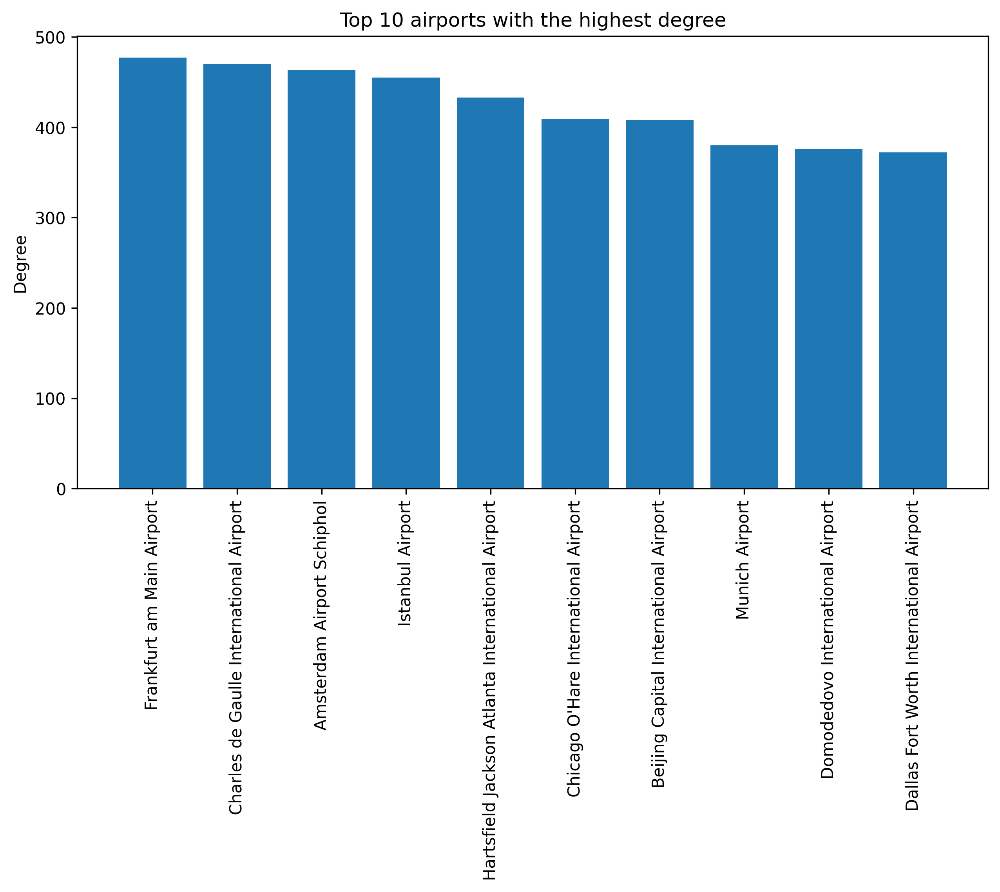

Using the collected data, we constructed a network of international airport connections. Each node in the graph is an airport, and each edge is a flight between the airports. The **weight** of each edge is the number of flights on that route, and the **degree** of each node is the number of connections to other airports. Each node/airport also have a set of attributes collected from the data:
1. City
2. Country
3. Latitude
4. Longitude
5. Airport name
6. Continent
7. BNP per capita

Using the latitude and longitude, we were able to visualize our graph in a number of ways. 
